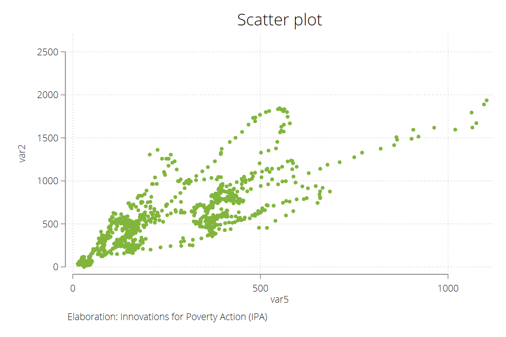
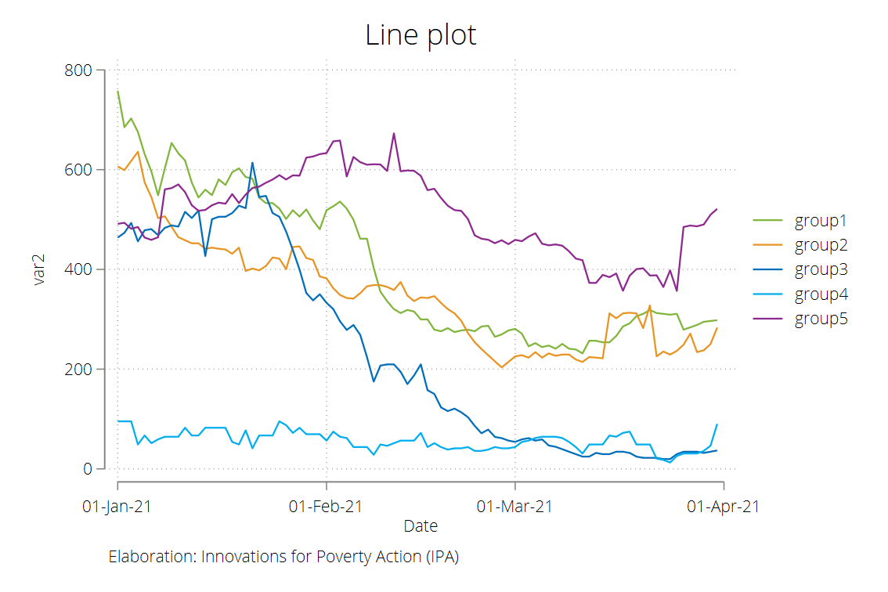
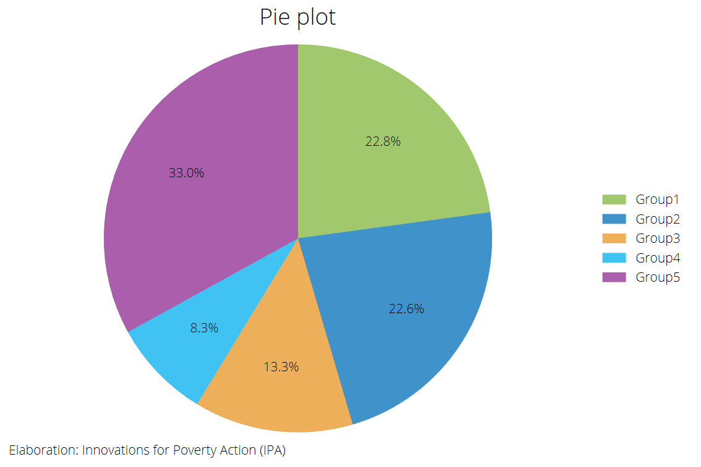
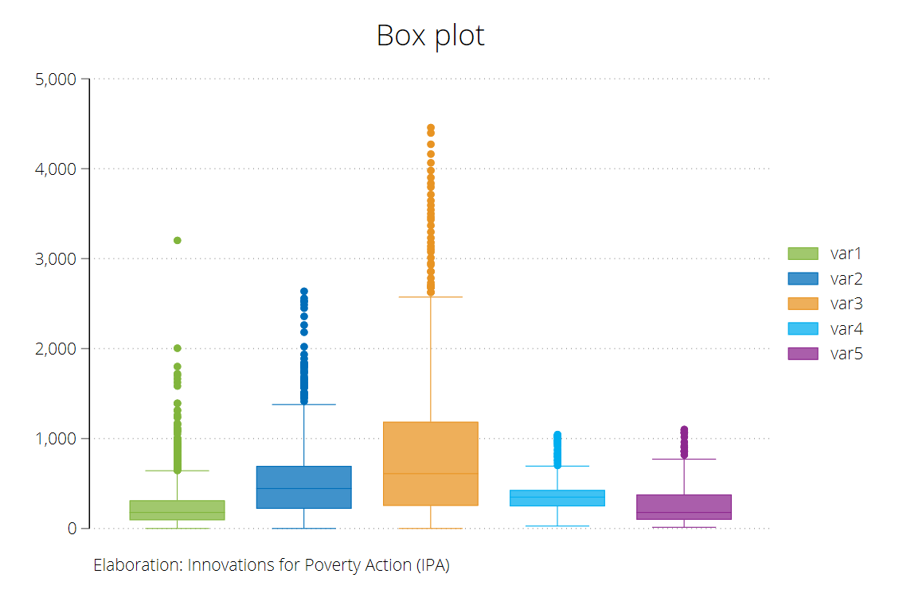
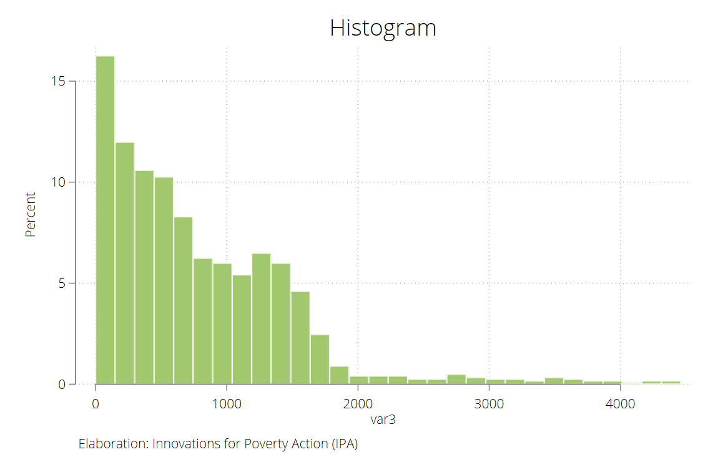
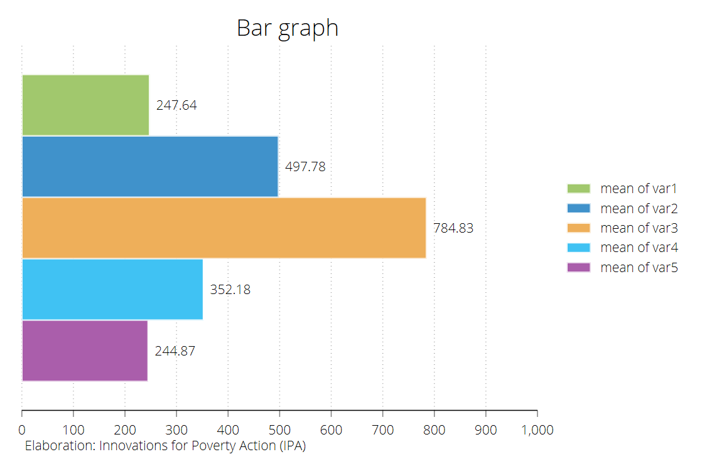
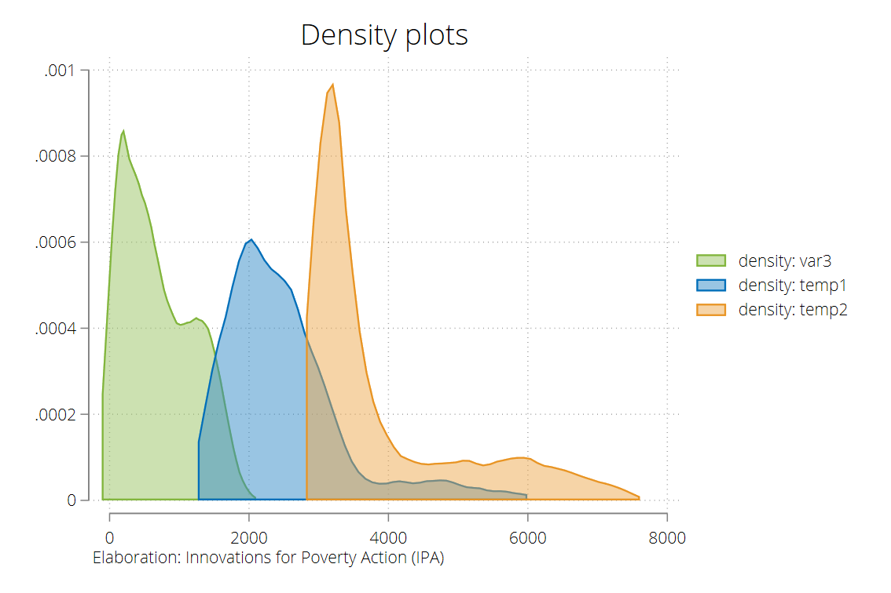
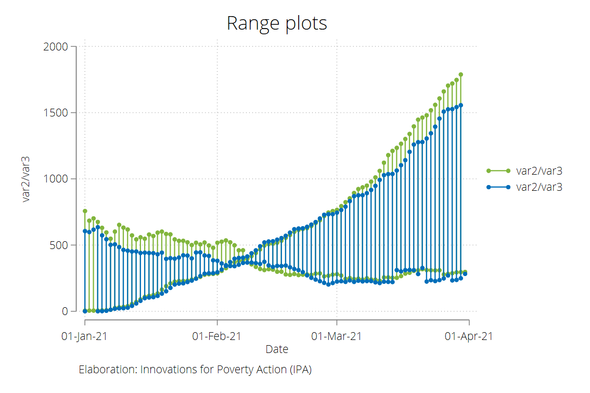
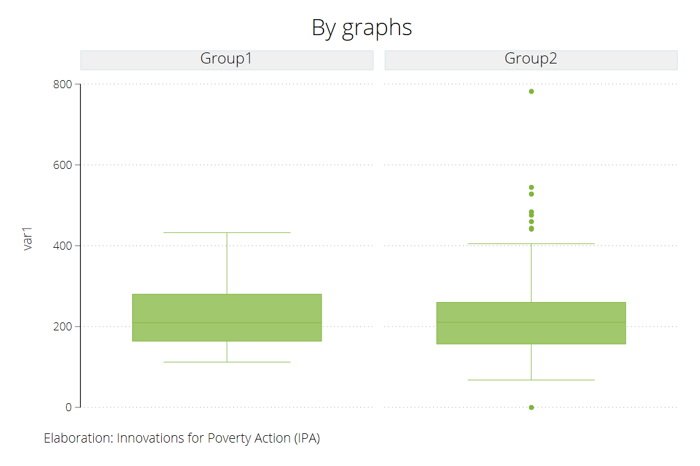

## ipaplots

Description: Stata scheme of Innovations for Poverty Action (IPA). This is a beta version.

## Installation
 ```
net install github, from("https://haghish.github.io/github/")
github install rmcondor/ipaplots

set scheme ipaplots
```

# Overview
 
 
 
 


## Author
IPA Peru
